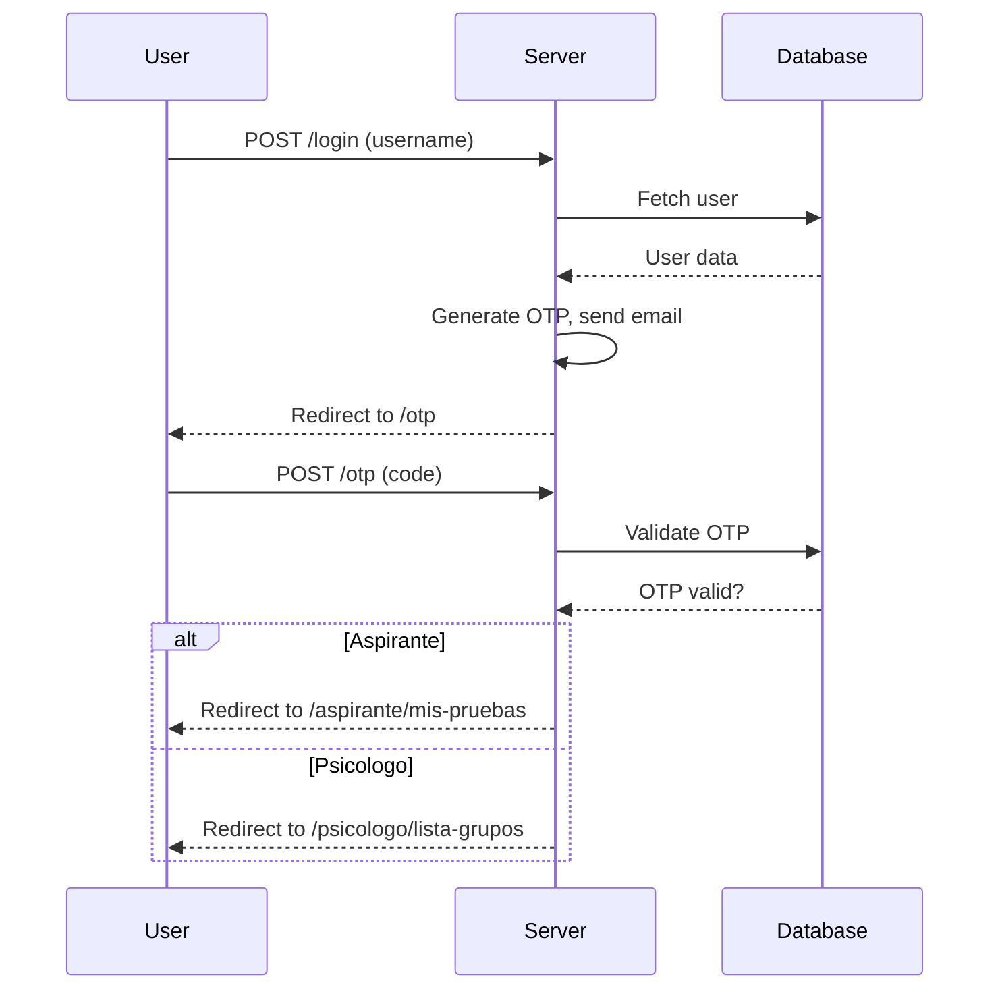
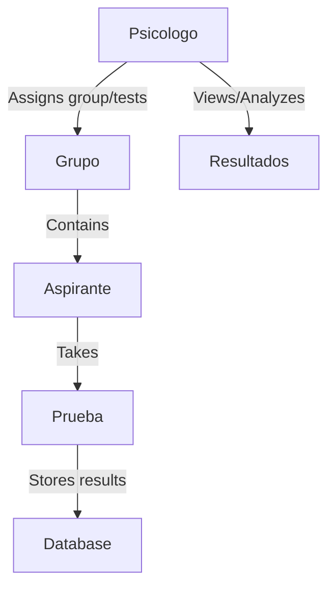
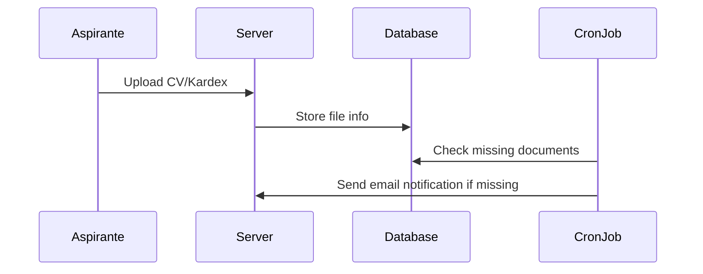
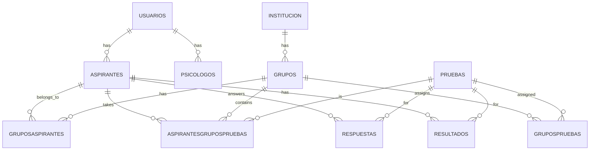
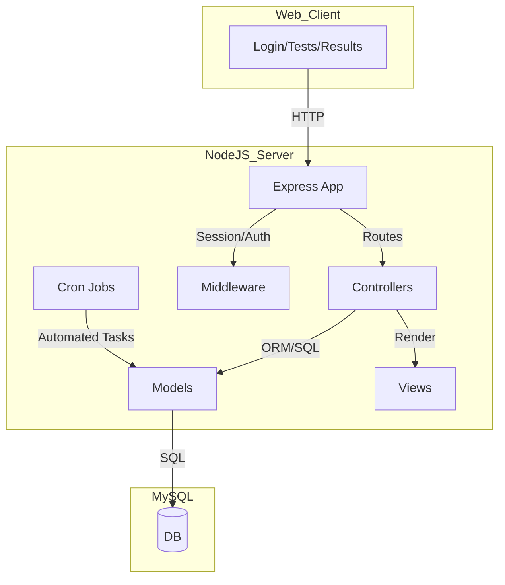

# VaultTech-Psytech: High-Level Documentation
## Overview

VaultTech-Psytech is a Node.js/Express web application for administering, applying, and analyzing psychometric tests (e.g., OTIS, Hartman, 16PF, Kostick, Terman, Colores) to students/aspirants, managed by expert psychologists. The system supports user authentication, group/institution management, test assignment, document uploads, and automated notifications.

## Main Features
- User Authentication: OTP-based login for security.
- User Roles:
  - Aspirante (Student/Test-taker)
  - Psicologo (Psychologist/Expert)
- Group & Institution Management: Psychologists manage groups, assign tests, and register institutions.
- Test Application: Multiple psychometric tests with custom flows, instructions, and result analysis.
- Document Management: Upload and track required documents (CV, Kardex).
- Automated Notifications: Cron jobs to remind users about missing documents.
- Result Analysis: Psychologists can view, analyze, and interpret test results.

## High-Level Architecture
```mermaid
flowchart TD
    subgraph Client
        Browser
    end

    subgraph Server
        App[Express App (app.js)]
        Routes[Routes]
        Controllers[Controllers]
        Models[Models]
        Views[EJS Views]
        Middleware[Middleware]
        Scripts[Scripts/Cron]
    end

    subgraph Database
        MySQL[(MySQL)]
    end

    Browser -- HTTP/HTTPS --> App
    App --> Middleware
    App --> Routes
    Routes --> Controllers
    Controllers --> Models
    Controllers --> Views
    Models -- SQL --> MySQL
    Scripts -- SQL --> MySQL
    Scripts -- Email --> EmailService
```

## Main Modules

### 1. Entry Point (`app.js`)
- Sets up Express, session, security (Helmet), compression, static files, EJS view engine, body parsing, and file uploads (Multer).
- Registers routes for login, aspirante, and psicologo.
- Schedules cron jobs for notifications.

### 2. Routes
- **inicioSesion.routes.js**: Login, OTP, logout.
- **aspirante.routes.js**: All aspirant flows (tests, documents, forms).
- **psicologo.routes.js**: Psychologist dashboard, group/institution management, test analysis.

### 3. Controllers
- **aspirante.controller.js**: Handles all aspirant actions (test flows, uploads, forms).
- **psicologo.controller.js**: Handles psychologist actions (group/test management, analysis).
- **inicioSesion.controller.js**: Handles authentication and OTP.

### 4. Models
- **User/Role Models**: `usuario.model.js`, `psicologo.model.js`, `aspirante.model.js`
- **Group/Institution Models**: `grupo.model.js`, `institucion.model.js`
- **Test Models**: `prueba.model.js`, `hartman.model.js`, `respondeKostick.model.js`, etc.
- **Result Models**: `resultadosKostick.model.js`, `resultados16PF.model.js`, etc.
- **Auxiliary Models**: For catalogues, options, questions, etc.

### 5. Views
- EJS templates for all user-facing pages, separated by role and feature.

### 6. Scripts
- **sendDocumentNotifications.js**: Cron job for sending document reminders.

## User Flows

### 1. Authentication & Role Routing



### 2. Test Assignment & Application



### 3. Document Upload & Notification



## Database (ER) Diagram (Simplified)



## Psychometric Tests Supported

- **OTIS**: Verbal, logical, spatial, and numerical reasoning.
- **Hartman**: Value profile, two-phase ranking.
- **16PF**: Personality factors.
- **Kostick**: Work personality.
- **Terman**: Mental aptitude.
- **Colores**: Color-based personality/decision test.

Each test has:
- Instructions
- Personal data form
- Question/answer flow
- Result calculation and storage
- Psychologist analysis view

## Onboarding Checklist for New Engineers

1. **Clone the repository** and install dependencies.
2. **Set up the database** using `psytech.sql`.
3. **Configure environment variables** (see `.env.example` or ask a lead).
4. **Run the app**: `node Psytech/app.js` (or use `npm start` if available).
5. **Explore the codebase**:
    - Start with `app.js` for the app structure.
    - Review routes and controllers for user flows.
    - Check models for data structure.
    - Look at EJS views for UI.
6. **Understand the test flows** by following the aspirante and psicologo routes.
7. **Check the cron job** in `scripts/sendDocumentNotifications.js` for automated features.

## Useful Diagrams

### System Overview



## Additional Notes

- **Security**: Uses Helmet, session management, and OTP for login.
- **File Uploads**: Multer for CV/Kardex and Excel imports.
- **Notifications**: Automated email reminders for missing documents.
- **Extensibility**: New tests can be added by extending models, controllers, and views.

**For more details, see the code in each module and the SQL schema for full table definitions.**